# code structure
```
root/
├── data/
│   └── cache/
│       └── KEYPO功能手冊文件.md
├── img/
│   └── Sentiment_flow.svg
└── sentiment_bot/
    ├── dockerfile
    ├── requirements.txt
    └── sentiment_bot.py
├── .env
├── .gitignore
├── dockerfile
├── README.md
└── requirements.txt
```

## 輿情分析機器人
### 使用方式
```
docker build -t sentiment-bot .
docker run -e GOOGLE_API_KEY="{YOUR_API_KEY}" sentiment-bot
```

### 篩選了幾種
NER和情感分析Model選取，嘗試了以下幾種，最後綜合表現由`Gemini本人`勝出  
1. spaCy（zh-core-web-sm, zh-core-web-md, zh-core-web-lg, zh-core-web-trf）
2. Transformers(Bert) - huggingface
3. Flair
4. nltk（沒有支援中文）
5. Gemini本人

### 流程說明


1. **A[Start]**：工作流開始，接收使用者輸入的問題。
2. **B[check_sentiment_related]**：檢查問題是否與輿情分析相關。
   - 若「是」，進入 **C[extract_keywords]**。
   - 若「否」，直接跳到 **F[format_response]**，返回「抱歉」訊息。
3. **C[extract_keywords]**：提取新聞關鍵字。
4. **D[fetch_news]**：根據關鍵字抓取新聞。
5. **E[analyze_content]**：分析新聞內容（情緒、NER、摘要）。
6. **F[format_response]**：格式化最終回應。
7. **G[End]**：工作流結束，輸出結果。

